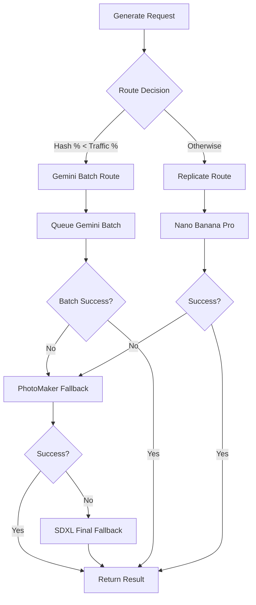

  ____    _    ____  __  __ _____  __  __
 / ___|  / \  |  _ \|  \/  | ____| \ \/ /
| |  _  / _ \ | |_) | |\/| |  _|    \  / 
| |_| |/ ___ \|  _ <| |  | | |___   /  \ 
 \____/_/   \_\_| \_\_|  |_|_____| /_/\_\

# GARMAX AI - Features Implementation

**Comprehensive guide to advanced features and AI systems in GARMAX AI.** This document explains the implementation of key features including the AI rendering pipeline, virtual try-on system, SMPL processing, and Gemini batch integration with architectural concepts and practical examples.

## 🔍 Key Files Quick Reference

### 🎨 AI Rendering Engine
- **[`src/services/aiRenderingService.ts`](src/services/aiRenderingService.ts)** - Main rendering coordinator with provider routing
- **[`src/services/geminiImageService.ts`](src/services/geminiImageService.ts)** - Google Gemini Imagen 3 batch processing
- **[`src/services/batchImageService.ts`](src/services/batchImageService.ts)** - Hybrid batch orchestration system
- **[`iac/lambda-handlers/aiRenderProcessor/index.ts`](iac/lambda-handlers/aiRenderProcessor/index.ts)** - Lambda AI rendering processor

### 🤖 SMPL 3D Processing
- **[`smpl-processor/smpl_processor.py`](smpl-processor/smpl_processor.py)** - Complete SMPL pose estimation pipeline
- **[`iac/lambda-handlers/tryonProcessor/index.ts`](iac/lambda-handlers/tryonProcessor/index.ts)** - Lambda try-on coordinator
- **[`src/services/garmentAnalysisService.ts`](src/services/garmentAnalysisService.ts)** - AWS Rekognition garment classification

### 👕 Virtual Try-On System
- **[`src/controllers/tryon/tryonController.ts`](src/controllers/tryon/tryonController.ts)** - Try-on session management API
- **[`src/services/subscriptionService.ts`](src/services/subscriptionService.ts)** - Stripe subscription integration
- **[`src/services/creditsService.ts`](src/services/creditsService.ts)** - Credit-based billing system
- **[`client/src/pages/VirtualTryonStudio.tsx`](client/src/pages/VirtualTryonStudio.tsx)** - Main try-on interface

### ⚡ Real-Time & Events
- **[`src/websocket/tryonWebSocket.ts`](src/websocket/tryonWebSocket.ts)** - WebSocket real-time updates
- **[`src/services/jobStatusService.ts`](src/services/jobStatusService.ts)** - Job status management
- **[`iac/lib/EventBridge/createTryonEventBus.ts`](iac/lib/EventBridge/createTryonEventBus.ts)** - Event-driven architecture

### 🎮 Frontend Components
- **[`client/src/components/tryon/TryonCanvas.tsx`](client/src/components/tryon/TryonCanvas.tsx)** - React Three Fiber 3D canvas
- **[`client/src/components/tryon/ProcessingModal.tsx`](client/src/components/tryon/ProcessingModal.tsx)** - Real-time processing UI
- **[`client/src/components/tryon/GarmentUploader.tsx`](client/src/components/tryon/GarmentUploader.tsx)** - Drag-drop garment upload

## 🎨 AI Rendering Pipeline

### Multi-Provider Architecture

The AI rendering system uses a sophisticated routing mechanism to balance cost, quality, and reliability across multiple AI providers.

**Traffic Routing Strategy** ([`aiRenderingService.ts`](src/services/aiRenderingService.ts))

```typescript
/**
 * Hash-based routing for consistent user experience
 * Same user always gets same provider (no quality jumping)
 */
private shouldRouteToGemini(userId?: string): boolean {
  if (!ENABLE_GEMINI_BATCH || GEMINI_TRAFFIC_PERCENT === 0) {
    return false;
  }

  // Hash user ID for deterministic routing
  const hash = userId ? crypto.createHash('sha256').update(userId).digest('hex') : '0';
  const hashNumber = parseInt(hash.substring(0, 8), 16);
  
  return (hashNumber % 100) < GEMINI_TRAFFIC_PERCENT;
}
```

**Failover Chain Implementation**



### Gemini Batch Processing

**Hybrid Batching Algorithm** ([`batchImageService.ts`](src/services/batchImageService.ts))

The system collects requests into efficient batches using two triggers:

```typescript
/**
 * Hybrid batching: collect requests until either condition met:
 * - Max batch size reached (50 images)
 * - Timeout elapsed (45 seconds)
 */
async collectBatchRequests(maxSize: number = 50, timeoutMs: number = 45000) {
  return new Promise((resolve) => {
    const batch: GeminiRequest[] = [];
    const startTime = Date.now();
    
    const checkBatch = () => {
      if (batch.length >= maxSize || Date.now() - startTime >= timeoutMs) {
        resolve(batch);
      } else {
        setTimeout(checkBatch, 1000); // Check every second
      }
    };
    
    checkBatch();
  });
}
```

**Cost Optimization Benefits:**
- **Batch Processing**: 50 images → ~$0.02 per image (vs $0.05 individual)
- **Smart Timeouts**: Prevents long waits during low traffic
- **Circuit Breakers**: Daily budget limits prevent cost spikes

### Provider-Specific Implementations

**Replicate Nano Banana Pro** (Fashion-specialized model)
```typescript
const output = await replicate.run("google/nano-banana-pro:latest", {
  input: {
    image: options.personImage,           // User photo
    garment: options.garmentImage,        // Garment to try on
    pose_image: options.poseGuidance,     // SMPL-generated pose map
    depth_map: options.depthMap,          // 3D depth information
    prompt: "professional fashion photography, high quality",
    negative_prompt: "blurry, low quality, distorted, nude, nsfw",
    num_inference_steps: 20,
    guidance_scale: 7.5
  }
});
```

**PhotoMaker Identity Preservation** (Fallback for face consistency)
```typescript
const output = await replicate.run("tencentarc/photomaker", {
  input: {
    prompt: this.buildIdentityAwarePrompt(options),
    input_image: options.personImage,
    input_image2: options.garmentImage,
    style_name: "Photographic (Default)",
    guidance_scale: 5.0,
    num_outputs: 1
  }
});
```

**Gemini Imagen 3** (Cost-effective batch processing)
```typescript
// Batch API call with OAuth authentication
const batchRequest = {
  requests: batch.map(item => ({
    imageGenerationConfig: {
      prompt: item.prompt,
      aspectRatio: "1:1",
      safetyFilterLevel: "BLOCK_FEW",
      personGeneration: "ALLOW_ADULT"
    }
  }))
};

const response = await geminiApi.generateImages(batchRequest);
```

## 🤖 SMPL 3D Processing Pipeline

### Pose Estimation Workflow

The SMPL (Skinned Multi-Person Linear) model system converts 2D photos into 3D human pose information for accurate virtual try-on.

**Complete Pipeline** ([`smpl_processor.py`](smpl-processor/smpl_processor.py))

```python
def process_image(self, session_id: str, user_id: str, 
                  avatar_image_key: str, garment_image_key: str) -> Dict[str, Any]:
    """
    Complete SMPL processing pipeline:
    1. Download images from S3
    2. Estimate 3D pose using ROMP
    3. Fit body mesh with SMPLify-X  
    4. Generate guidance assets
    5. Upload results and publish events
    """
    
    # Step 1: Download input images
    avatar_path = self._download_from_s3(avatar_image_key)
    garment_path = self._download_from_s3(garment_image_key)
    
    # Step 2: ROMP pose estimation - 3D human pose recovery
    pose_results = self._estimate_pose_romp(avatar_path)
    
    # Step 3: SMPLify-X body mesh fitting - accurate body shape
    mesh_results = self._fit_body_mesh(avatar_path, pose_results)
    
    # Step 4: Generate conditioning assets for AI rendering
    guidance_assets = self._generate_guidance_assets(
        avatar_path, garment_path, pose_results, mesh_results
    )
    
    # Step 5: Upload to S3 and notify downstream systems
    s3_keys = self._upload_guidance_assets(session_id, guidance_assets)
    self._publish_completion_event(session_id, user_id, s3_keys, mesh_results)
```

### Guidance Asset Generation

**ControlNet Conditioning Maps** - These guide the AI rendering for accurate results:

```python
def _generate_guidance_assets(self, avatar_path: str, garment_path: str,
                             pose_results: Dict, mesh_results: Dict) -> Dict[str, str]:
    """
    Generate 4 types of guidance maps for ControlNet conditioning:
    """
    
    # 1. Depth Map - 3D spatial consistency
    depth_map = self._generate_depth_map(mesh_results['body_mesh'])
    
    # 2. Normal Map - Surface lighting and texture information  
    normal_map = self._generate_normal_map(mesh_results['body_mesh'])
    
    # 3. Pose Map - Human joint and limb alignment
    pose_map = self._draw_pose_skeleton(pose_results['poses_2d'])
    
    # 4. Segmentation Mask - Clothing regions and body parts
    segmentation_mask = self._segment_body_regions(
        avatar_path, mesh_results['body_shape']
    )
    
    return {
        'depth': depth_map,
        'normals': normal_map, 
        'pose': pose_map,
        'segment': segmentation_mask
    }
```

### SMPL Model Architecture

**Body Parameter Representation:**
- **Shape Parameters (β)**: 10 coefficients controlling body shape (height, weight, proportions)
- **Pose Parameters (θ)**: 72 coefficients for joint rotations (24 joints × 3 rotation axes)
- **Global Orientation**: 3 coefficients for overall body rotation
- **Translation**: 3D position in world coordinates

```python
# Example SMPL parameter extraction
def _extract_smpl_parameters(self, mesh_results: Dict) -> Dict:
    return {
        'beta': mesh_results['body_shape'],      # [10] shape parameters
        'theta': mesh_results['body_pose'],       # [72] pose parameters  
        'global_orient': mesh_results['global_orient'], # [3] global rotation
        'translation': mesh_results['translation']       # [3] world position
    }
```

## 👕 Virtual Try-On System

### Session Management Architecture

**Try-On Workflow** ([`tryonController.ts`](src/controllers/tryon/tryonController.ts))

```typescript
/**
 * Complete try-on session lifecycle:
 * 1. Create session with user inputs
 * 2. Process through SMPL pipeline  
 * 3. Generate AI renders
 * 4. Present preview to user
 * 5. Confirm and charge credits
 */

// 1. Session Creation
app.post('/api/tryon/sessions', async (req, res) => {
  const { avatarUrl, garmentUrl, preferences } = req.body;
  
  // Validate subscription limits
  const canCreate = await subscriptionService.checkTryonQuota(userId);
  if (!canCreate) {
    return res.status(429).json({ error: 'Monthly quota exceeded' });
  }
  
  // Create session and trigger processing
  const session = await tryonService.createSession({
    userId,
    avatarUrl,
    garmentUrl,
    preferences
  });
  
  // Publish event to start SMPL processing
  await eventBridge.putEvents({
    Entries: [{
      Source: 'garmax-ai.tryon',
      DetailType: 'Tryon Requested',
      Detail: JSON.stringify({
        sessionId: session.id,
        userId,
        avatarImageKey: avatarUrl,
        garmentImageKey: garmentUrl
      })
    }]
  });
  
  res.json({ sessionId: session.id });
});
```

### Credit-Based Billing System

**Dynamic Pricing Model** ([`creditsService.ts`](src/services/creditsService.ts))

```typescript
/**
 * Credit costs based on quality and processing complexity:
 * - Avatar Creation: 5 credits (one-time SMPL processing)
 * - SD Rendering: 10 credits (~$0.01)
 * - HD Rendering: 15 credits (~$0.015)  
 * - 4K Rendering: 25 credits (~$0.025)
 */

class CreditsService {
  async chargeForRender(userId: string, quality: RenderQuality): Promise<boolean> {
    const costs = {
      'sd': 10,    // Standard definition
      'hd': 15,    // High definition
      '4k': 25     // Ultra high definition
    };
    
    const creditCost = costs[quality];
    const userCredits = await this.getUserCredits(userId);
    
    if (userCredits < creditCost) {
      throw new Error('Insufficient credits');
    }
    
    // Atomic credit deduction with transaction
    await this.deductCredits(userId, creditCost, {
      type: 'render',
      quality,
      sessionId: context.sessionId
    });
    
    return true;
  }
  
  async refundForCancellation(userId: string, sessionId: string): Promise<void> {
    const transaction = await this.getTransaction(sessionId);
    
    // Full refund for cancellations within 5 minutes
    const refundAmount = transaction.amount;
    await this.addCredits(userId, refundAmount, {
      type: 'refund',
      originalTransactionId: transaction.id,
      reason: 'user_cancellation'
    });
  }
}
```

### Subscription Integration

**Stripe Subscription Management** ([`subscriptionService.ts`](src/services/subscriptionService.ts))

```typescript
/**
 * Subscription tiers with different limits:
 * - Free: 1 avatar, 0 try-ons/month
 * - Studio: 3 avatars, 25 try-ons/month  
 * - Pro: 5 avatars, 100 try-ons/month
 */

class SubscriptionService {
  async checkTryonQuota(userId: string): Promise<boolean> {
    const subscription = await this.getUserSubscription(userId);
    const usage = await this.getMonthlyUsage(userId);
    
    const limits = {
      'free': { avatars: 1, tryons: 0 },
      'studio': { avatars: 3, tryons: 25 },
      'pro': { avatars: 5, tryons: 100 }
    };
    
    const userLimits = limits[subscription.plan];
    return usage.tryons < userLimits.tryons;
  }
  
  async handleStripeWebhook(event: Stripe.Event): Promise<void> {
    switch (event.type) {
      case 'customer.subscription.created':
        await this.activateSubscription(event.data.object as Stripe.Subscription);
        break;
        
      case 'customer.subscription.deleted':  
        await this.cancelSubscription(event.data.object as Stripe.Subscription);
        break;
        
      case 'invoice.payment_succeeded':
        await this.grantMonthlyCredits(event.data.object as Stripe.Invoice);
        break;
    }
  }
}
```

## ⚡ Real-Time Processing Updates

### WebSocket Architecture

**Room-Based Broadcasting** ([`tryonWebSocket.ts`](src/websocket/tryonWebSocket.ts))

```typescript
/**
 * Real-time status updates for try-on processing:
 * - SMPL processing progress (0-50%)
 * - AI rendering queue position (50-80%)  
 * - Final result delivery (80-100%)
 */

class TryonWebSocket {
  onConnection(socket: Socket) {
    socket.on('join-session', (sessionId: string) => {
      // Join room for this specific try-on session
      socket.join(`session-${sessionId}`);
    });
  }
  
  broadcastStatusUpdate(sessionId: string, update: StatusUpdate) {
    // Send to all clients watching this session
    io.to(`session-${sessionId}`).emit('status-update', {
      sessionId,
      status: update.status,        // 'processing' | 'queued' | 'complete' | 'error'
      stage: update.stage,          // 'smpl' | 'rendering' | 'finalizing'
      progress: update.progress,    // 0-100
      message: update.message,      // Human-readable status
      estimatedTime: update.eta     // Remaining time estimate
    });
  }
  
  // Called by Lambda functions via API
  async updateFromProcessor(sessionId: string, processorType: string, data: any) {
    const progressMap = {
      'smpl-start': 10,
      'smpl-pose-complete': 25, 
      'smpl-mesh-complete': 40,
      'smpl-guidance-complete': 50,
      'ai-queued': 60,
      'ai-processing': 75,
      'ai-complete': 90,
      'finalizing': 95,
      'complete': 100
    };
    
    this.broadcastStatusUpdate(sessionId, {
      status: data.status,
      stage: processorType,
      progress: progressMap[data.event] || 0,
      message: data.message
    });
  }
}
```

### Job Status Management

**Distributed State Tracking** ([`jobStatusService.ts`](src/services/jobStatusService.ts))

```typescript
/**
 * Centralized job status management across Lambda functions:
 * - Tracks processing pipeline stage
 * - Estimates completion times
 * - Handles error states and retries
 */

class JobStatusService {
  async updateJobStatus(sessionId: string, update: JobUpdate): Promise<void> {
    // Update database with current status
    await db.update(tryonSessions)
      .set({
        status: update.status,
        currentStage: update.stage,
        progress: update.progress,
        updatedAt: new Date(),
        metadata: update.metadata
      })
      .where(eq(tryonSessions.id, sessionId));
    
    // Broadcast to WebSocket clients
    await this.websocket.broadcastStatusUpdate(sessionId, update);
    
    // Handle stage-specific logic
    switch (update.stage) {
      case 'smpl-complete':
        // Trigger AI rendering
        await this.triggerAIRendering(sessionId);
        break;
        
      case 'ai-complete':
        // Prepare preview for user approval
        await this.preparePreview(sessionId);
        break;
        
      case 'error':
        // Handle failures and potential retries
        await this.handleProcessingError(sessionId, update.error);
        break;
    }
  }
}
```

## 🎮 Frontend 3D Interface

### React Three Fiber Canvas

**3D Try-On Visualization** ([`TryonCanvas.tsx`](client/src/components/tryon/TryonCanvas.tsx))

```typescript
/**
 * Interactive 3D canvas for avatar and garment preview:
 * - GLTF avatar loading and display
 * - Texture-based garment overlays
 * - Real-time mesh deformation
 * - Orbit controls for user interaction
 */

function TryonCanvas({ avatarUrl, garmentTexture, smplData }) {
  const avatarRef = useRef<THREE.Group>();
  const { camera, scene } = useThree();
  
  // Load avatar GLTF model
  const { scene: avatarScene } = useGLTF(avatarUrl);
  
  // Apply SMPL deformation to avatar mesh
  useEffect(() => {
    if (avatarRef.current && smplData) {
      const mesh = avatarRef.current.children[0] as THREE.SkinnedMesh;
      
      // Apply SMPL pose parameters to skeleton
      smplData.pose.forEach((rotation, jointIndex) => {
        const bone = mesh.skeleton.bones[jointIndex];
        bone.setRotationFromEuler(new THREE.Euler(...rotation));
      });
      
      // Update mesh with body shape parameters
      const morphTargets = mesh.morphTargetInfluences;
      smplData.shape.forEach((weight, shapeIndex) => {
        if (morphTargets && morphTargets[shapeIndex] !== undefined) {
          morphTargets[shapeIndex] = weight;
        }
      });
    }
  }, [smplData]);
  
  return (
    <Canvas camera={{ position: [0, 0, 5] }}>
      {/* Lighting setup */}
      <ambientLight intensity={0.4} />
      <directionalLight position={[10, 10, 5]} intensity={0.6} />
      
      {/* Avatar with garment overlay */}
      <group ref={avatarRef}>
        <primitive object={avatarScene} />
        {garmentTexture && (
          <mesh>
            <planeGeometry args={[2, 3]} />
            <meshBasicMaterial 
              map={garmentTexture} 
              transparent 
              opacity={0.8}
            />
          </mesh>
        )}
      </group>
      
      {/* Camera controls */}
      <OrbitControls
        enablePan={false}
        minDistance={3}
        maxDistance={10}
        minPolarAngle={Math.PI / 4}
        maxPolarAngle={Math.PI / 2}
      />
    </Canvas>
  );
}
```

### Processing Modal with Real-Time Updates

**Live Processing Feedback** ([`ProcessingModal.tsx`](client/src/components/tryon/ProcessingModal.tsx))

```typescript
/**
 * Real-time processing modal with WebSocket updates:
 * - Multi-stage progress visualization
 * - Preview approval workflow
 * - Auto-confirm countdown timer
 * - Error handling and retry options
 */

function ProcessingModal({ sessionId, onComplete, onCancel }) {
  const [status, setStatus] = useState<ProcessingStatus>({
    stage: 'smpl',
    progress: 0,
    message: 'Starting 3D pose analysis...'
  });
  
  const [preview, setPreview] = useState<string | null>(null);
  const [autoConfirmTimer, setAutoConfirmTimer] = useState(30);
  
  // WebSocket connection for real-time updates
  useEffect(() => {
    const socket = io('/tryon');
    
    socket.emit('join-session', sessionId);
    
    socket.on('status-update', (update: StatusUpdate) => {
      setStatus({
        stage: update.stage,
        progress: update.progress,
        message: update.message
      });
      
      // Show preview when AI rendering completes
      if (update.status === 'preview-ready') {
        setPreview(update.previewUrl);
        startAutoConfirmTimer();
      }
    });
    
    return () => socket.disconnect();
  }, [sessionId]);
  
  // Auto-confirm countdown for seamless UX
  const startAutoConfirmTimer = () => {
    const interval = setInterval(() => {
      setAutoConfirmTimer(prev => {
        if (prev <= 1) {
          clearInterval(interval);
          handleConfirm(); // Auto-approve after 30 seconds
          return 0;
        }
        return prev - 1;
      });
    }, 1000);
  };
  
  return (
    <Modal open onClose={onCancel}>
      {!preview ? (
        // Processing view
        <ProcessingView 
          stage={status.stage}
          progress={status.progress}
          message={status.message}
        />
      ) : (
        // Preview approval view  
        <PreviewView
          previewUrl={preview}
          autoConfirmTimer={autoConfirmTimer}
          onConfirm={handleConfirm}
          onReject={handleReject}
        />
      )}
    </Modal>
  );
}
```

## 🔧 Advanced Configuration

### Feature Flag Management

**Gradual Rollout Controls** ([`parameters/config.ts`](parameters/config.ts))

```typescript
/**
 * Feature flags for safe production rollouts:
 * - AI provider routing percentages
 * - Processing mode selection
 * - Cost protection thresholds
 */

export const getFeatureConfig = () => ({
  // AI Rendering Configuration
  enableGeminiBatch: process.env.ENABLE_GEMINI_BATCH === 'true',
  geminiTrafficPercent: parseInt(process.env.GEMINI_TRAFFIC_PERCENT || '0'),
  
  // Processing Configuration
  smplProcessingMode: process.env.SMPL_PROCESSING_MODE || 'LAMBDA', // LAMBDA | ECS
  enableEcsHeavyJobs: process.env.ENABLE_ECS_HEAVY_JOBS === 'true',
  
  // Cost Protection
  allowBedrockFailover: process.env.ALLOW_BEDROCK_FAILOVER === 'false', // OFF by default
  bedrockDailyBudget: parseFloat(process.env.BEDROCK_DAILY_BUDGET_USD || '50'),
  
  // Rate Limiting
  maxRendersPerUserDaily: parseInt(process.env.MAX_RENDERS_PER_USER_DAILY || '20'),
  maxConcurrentRendersPerUser: parseInt(process.env.MAX_CONCURRENT_RENDERS_PER_USER || '3')
});
```

### Quality Tier Mapping

**Rendering Quality Configuration**

```typescript
/**
 * Quality tiers mapped to provider-specific settings:
 * - SD: Fast, cost-effective (1024px, 20 steps)
 * - HD: Balanced quality/cost (1024px, 30 steps)  
 * - 4K: Premium quality (1024px + upscaling, 50 steps)
 */

const qualitySettings = {
  'sd': {
    width: 1024,
    height: 1024, 
    steps: 20,
    guidance_scale: 7.5,
    cost_estimate: 0.01
  },
  'hd': {
    width: 1024,
    height: 1024,
    steps: 30, 
    guidance_scale: 8.0,
    cost_estimate: 0.015
  },
  '4k': {
    width: 1024,
    height: 1024,
    steps: 50,
    guidance_scale: 9.0,
    upscale: true,
    cost_estimate: 0.025
  }
};
```

## 🎯 Integration Examples

### Adding a New AI Provider

```typescript
// 1. Add to aiRenderingService.ts
class AIRenderingService {
  async generateWithNewProvider(options: TryOnRenderOptions): Promise<RenderResult> {
    try {
      const output = await newProviderApi.generate({
        prompt: options.prompt,
        image: options.personImage,
        conditioning: {
          pose: options.poseGuidance,
          depth: options.depthMap
        }
      });
      
      return {
        imageUrl: output.imageUrl,
        timeTaken: output.processingTime,
        method: "new-provider"
      };
    } catch (error) {
      // Fall back to next provider in chain
      return this.generatePhotoMakerRender(options, dimensions, startTime);
    }
  }
}
```

### Custom Garment Analysis

```typescript
// Extend garmentAnalysisService.ts for new garment types
class GarmentAnalysisService {
  async analyzeCustomGarment(imageBuffer: Buffer): Promise<GarmentAnalysis> {
    // Custom ML model for specialized garments (shoes, accessories, etc.)
    const result = await customModel.analyze(imageBuffer);
    
    return {
      category: result.category,
      subcategory: result.subcategory,
      overlayCapable: result.canOverlay,
      complexity: result.complexity,
      estimatedCredits: this.calculateCredits(result.complexity)
    };
  }
}
```

### WebSocket Event Extension

```typescript
// Add new event types to tryonWebSocket.ts
class TryonWebSocket {
  broadcastCustomEvent(sessionId: string, eventType: string, data: any) {
    io.to(`session-${sessionId}`).emit('custom-event', {
      type: eventType,
      sessionId,
      data,
      timestamp: Date.now()
    });
  }
}
```

## 🎉 Implementation Summary

This features guide covers the complete GARMAX AI system implementation:

### Core Achievements
- **Multi-Provider AI Rendering** with intelligent failover and cost optimization
- **SMPL 3D Processing** for accurate pose estimation and guidance generation  
- **Real-Time WebSocket Updates** for seamless user experience
- **Credit-Based Billing** with Stripe integration and quota management
- **Interactive 3D Interface** using React Three Fiber
- **Event-Driven Architecture** for scalable processing

### Key Benefits for Developers
- **Modular Architecture** enables easy feature additions
- **Comprehensive Error Handling** with graceful fallbacks
- **Real-Time Feedback** keeps users engaged during processing
- **Cost Controls** prevent budget overruns
- **Quality Tiers** balance performance and cost

### Next Steps for Feature Development
1. **Extend AI Providers** - Add new rendering services to the failover chain
2. **Enhanced Garment Support** - Support for shoes, accessories, complex items
3. **Advanced SMPL Features** - Body shape customization, pose variation
4. **Social Features** - Sharing, collections, community galleries
5. **Mobile Optimization** - React Native app with offline processing

**The foundation is solid - build amazing features on top! 🚀**